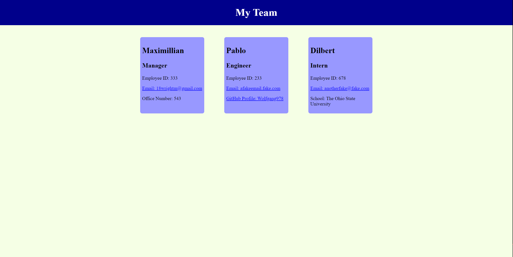

  # Team Profile generator

1. [Description](#Description)
2. [Install Instructions](#Install-Instructions)
3. [How to use this app](#How-to-use-this-app)
4. [License](#License)
5. [Credits](#Credits)
6. [Tests](#Tests)
7. [Github](#Github)
8. [Contact Me](#Contact-Me)

  
          
  
  
  ## Description 
  This application uses node to take in user imputs and build an html file with those inputs. This is done in the console
  and is very easy to use. I have used the npm packages inquirer and jest to test the application.
  
  ## Install Instructions
  No installation is necessary.
  
  ## How to use this app
  You have to open up your console or terminal and navigate into the correct folder. Then you type node index.js into the terminal and follow the prompts given.
  After the prompts are followed you will be asked if you want to create another employee or finish. Once you finish an html file is created.
  
  
## License
No license
        
    
  
  ## Credits
  This application was made by Maximillian

  ## Tests
  Testing was done with the npm package jest.

  ## Github 
 Here is the link to my github account [Wolfgang978](https://github.com/Wolfgang978)
  
  
  ## Contact Me
  If you have any further questions about the application you can reach me at 18wrightm@gmail.com

  ## Screenshot
  

  ## Video Link
  [Link to demonstration video](https://drive.google.com/file/d/1JScJ8b2V0p4Yw_gkzeAEqvjmmwLvoVSF/view)
 
